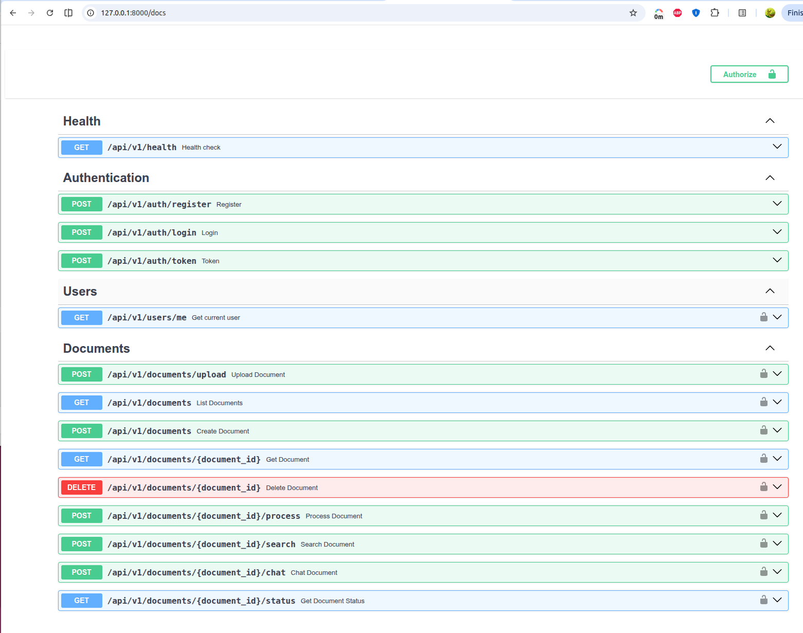
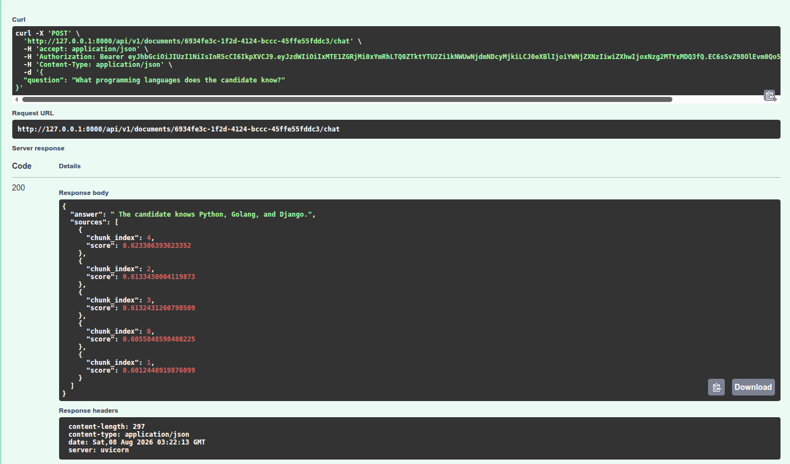

# KnowledgeHub

> A production-ready Retrieval-Augmented Generation (RAG) platform that enables users to upload documents, perform semantic search, and chat with their knowledge using local AI models.

KnowledgeHub demonstrates modern backend software engineering practices by combining **FastAPI**, **PostgreSQL (pgvector)**, **SentenceTransformers**, and **Ollama** to build an end-to-end document intelligence system.

---

## ✨ Features

### Implemented

- 🔐 JWT Authentication
- 📄 Document upload
- 📑 PDF and TXT text extraction
- ⚙️ Background document processing
- ✂️ Sentence-aware text chunking
- 🧠 Embedding generation using SentenceTransformers
- 🔍 Semantic search using PostgreSQL + pgvector
- 💬 Retrieval-Augmented Generation (RAG) chat
- 📚 Source attribution
- 📝 Structured logging
- ⚡ Global exception handling
- 🧪 Integration tests with Pytest
- 🏗 Clean Architecture (Service + Repository pattern)

### Planned

- React frontend
- Multi-document chat
- Conversation history
- Cloud storage
- CI/CD pipeline
- Deployment

---

# Why KnowledgeHub?

Large Language Models are only as useful as the context they receive.

KnowledgeHub explores how Retrieval-Augmented Generation (RAG) systems can be engineered using production-ready backend architecture instead of simple AI prototypes.

Users can upload documents, automatically process them into searchable embeddings, and ask natural language questions grounded entirely on their own knowledge.

The project focuses on backend engineering, software architecture, and AI integration rather than frontend development.

---

# Architecture

```
                        Client
                           │
                           ▼
                    FastAPI REST API
                           │
        ┌──────────────────┼──────────────────┐
        ▼                  ▼                  ▼
 Authentication     Document Service      Chat Service
                           │                  │
                           ▼                  │
                 Background Processing        │
                           │                  │
                           ▼                  │
                    Text Extraction           │
                           │                  │
                           ▼                  │
                 Sentence-aware Chunking      │
                           │                  │
                           ▼                  │
              SentenceTransformer Embeddings  │
                           │                  │
                           ▼                  │
                  PostgreSQL + pgvector ◄─────┘
                           │
                           ▼
                    Semantic Retrieval
                           │
                           ▼
                     Prompt Generation
                           │
                           ▼
                      Ollama (Mistral)
                           │
                           ▼
                        AI Response
```

---

# Screenshots
## Swagger API


---

## RAG Chat



# Document Processing Pipeline

```
Upload Document
        │
        ▼
Store File
        │
        ▼
Background Processing
        │
        ▼
Extract Text
        │
        ▼
Sentence-aware Chunking
        │
        ▼
Generate Embeddings
        │
        ▼
Store in PostgreSQL + pgvector
        │
        ▼
Ready for Search & Chat
```

---

# RAG Pipeline

```
User Question
        │
        ▼
Generate Query Embedding
        │
        ▼
Vector Similarity Search
        │
        ▼
Top-k Relevant Chunks
        │
        ▼
Build Prompt
        │
        ▼
Ollama (Mistral)
        │
        ▼
Answer + Source Chunks
```

---

# Tech Stack

## Backend

- Python
- FastAPI
- SQLAlchemy
- Alembic

## Database

- PostgreSQL
- pgvector

## AI

- SentenceTransformers
- Ollama
- Mistral

## Infrastructure

- Docker
- Docker Compose

## Testing

- Pytest

---

# Project Structure

```
backend/
│
├── app/
│   ├── api/
│   ├── core/
│   ├── db/
│   ├── embeddings/
│   ├── exceptions/
│   ├── llm/
│   ├── models/
│   ├── processors/
│   ├── prompts/
│   ├── repositories/
│   ├── schemas/
│   ├── services/
│   ├── storage/
│   ├── utils/
│   └── workers/
│
├── tests/
│   ├── api/
│   ├── integration/
│   ├── repositories/
│   └── services/
│
├── alembic/
├── Dockerfile
└── README.md
```

---

# Getting Started

## Clone the repository

```bash
git clone https://github.com/hieudoan7/knowledgehub.git

cd knowledgehub/backend
```

## Create environment file

```bash
cp .env.example .env.local
```

Update the environment variables as required.

---

## Install dependencies

Using uv

```bash
uv sync
```

---

## Run database migrations

```bash
uv run alembic upgrade head
```

---

## Start the application

```bash
uv run uvicorn app.main:app --reload
```

The API will be available at

```
http://localhost:8000
```

Interactive API documentation

```
http://localhost:8000/docs
```

---

# Running Tests

Run all tests

```bash
uv run pytest
```

Run integration tests

```bash
uv run pytest tests/integration
```

---

# Design Principles

KnowledgeHub follows several software engineering principles.

- Clean Architecture
- Repository Pattern
- Dependency Injection
- Separation of Concerns
- Configuration-driven design
- Structured logging
- Global exception handling
- Automated testing

---

# Current Status

Current Version

**v1.0 (Backend MVP)**

Completed

- Authentication
- Document Upload
- Background Processing
- Semantic Search
- RAG Chat
- Integration Testing

Currently Working On

- React Frontend
- Deployment
- CI/CD

---

# Future Improvements

- Streaming LLM responses
- Hybrid search (Vector + Keyword)
- Multi-document conversations
- User workspaces
- Cloud object storage
- Authentication with OAuth
- Production deployment
- Monitoring and metrics

---

# License

This project is licensed under the MIT License.

---

# About the Project

KnowledgeHub was built as a portfolio project to demonstrate modern backend software engineering and AI application development.

The project emphasizes production-ready architecture, maintainable code, automated testing, and practical Retrieval-Augmented Generation (RAG) techniques rather than experimental prototypes.